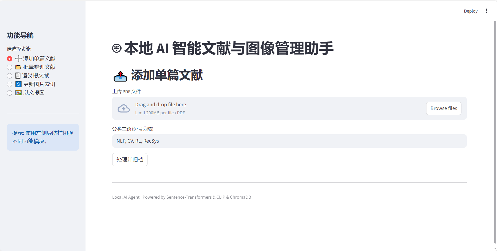
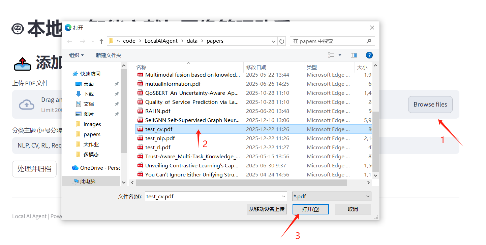
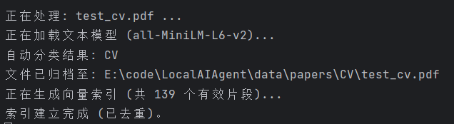
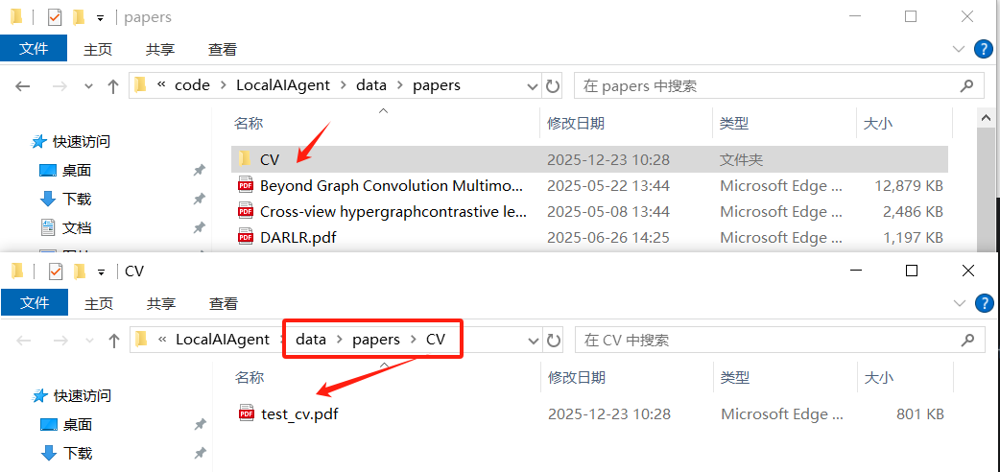
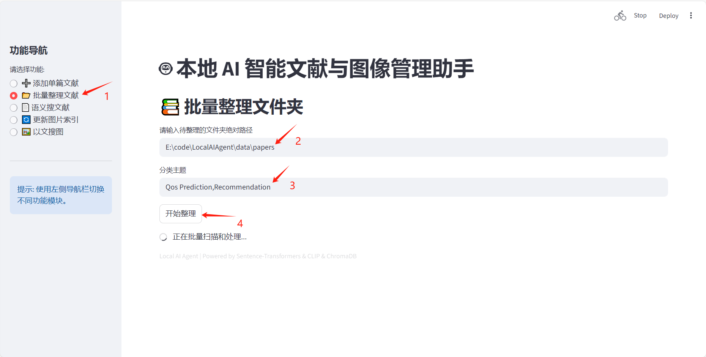
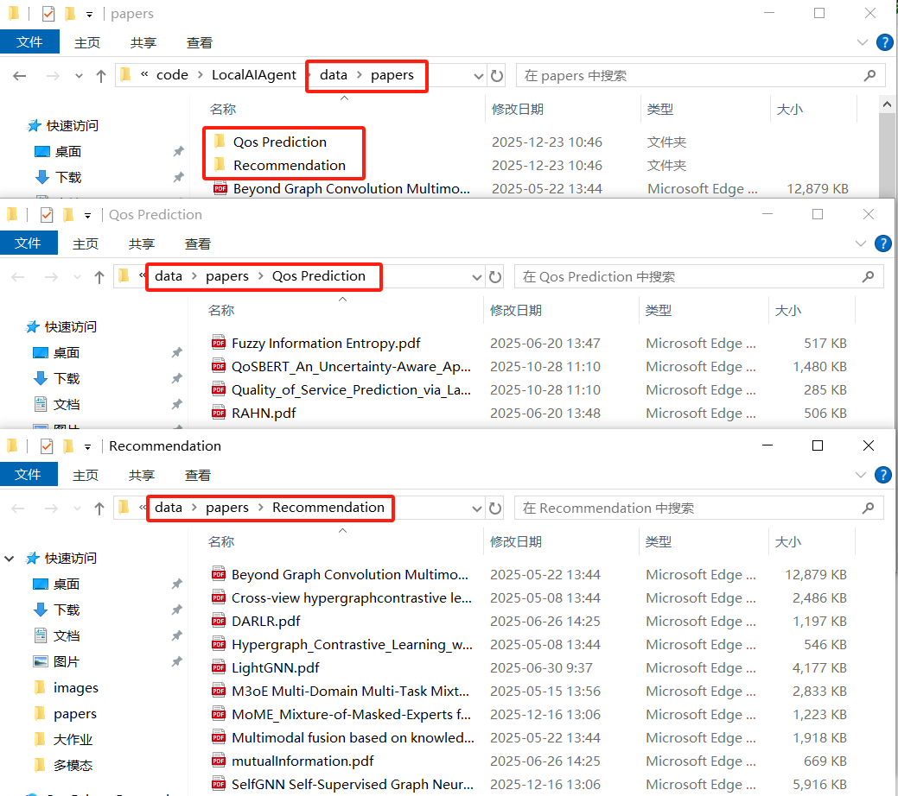
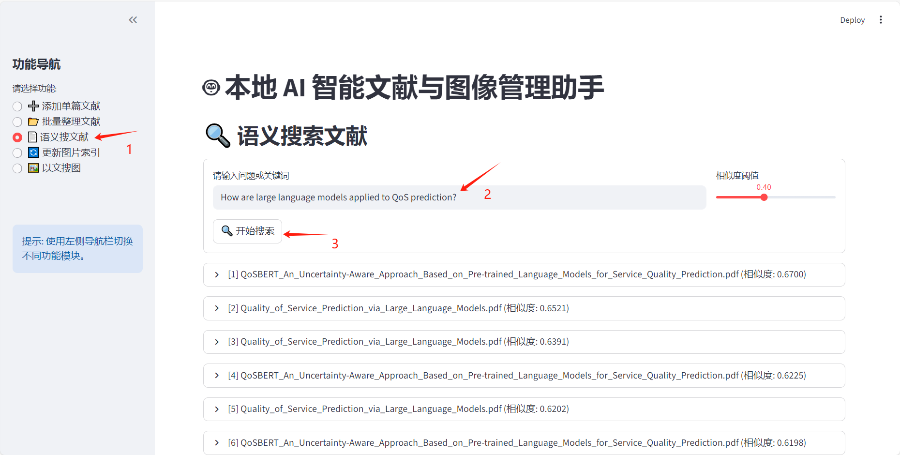
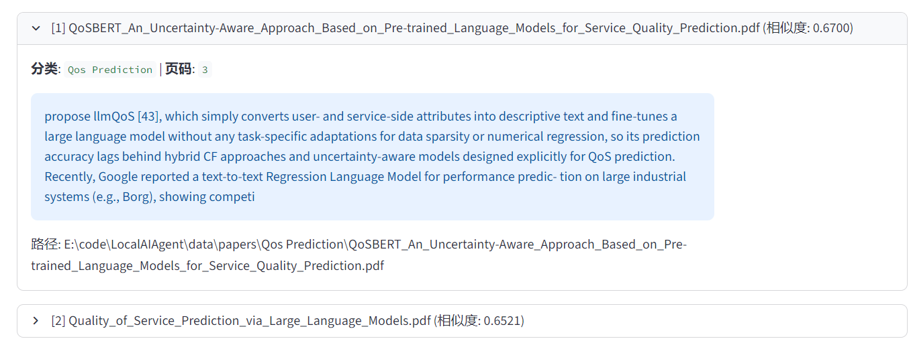
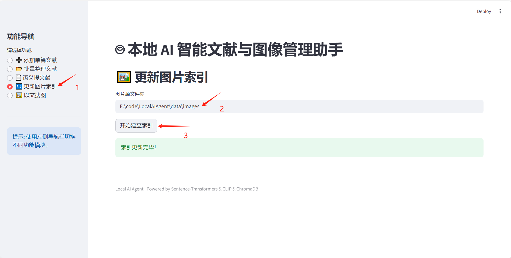
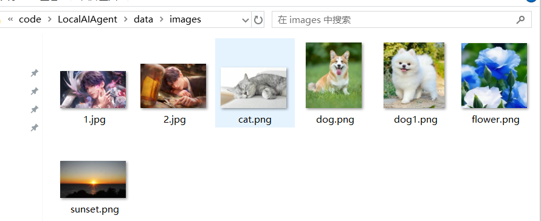

# Local Multimodal AI Agent (本地 AI 智能文献与图像管理助手)

## 📖 项目简介 (Project Introduction)

**Local Multimodal AI Agent** 是一个基于 Python 的本地化智能助手，旨在解决科研人员和学生面临的本地大量文献与图像素材管理难题。

不同于传统的文件名搜索，本项目利用最前沿的多模态神经网络技术（CLIP, Transformer），实现了对本地文件的**语义理解**。它不仅能读懂论文的内容，还能“看懂”图片，支持通过自然语言进行搜索、自动分类和整理。

本项目设计为**完全本地运行**，保护您的隐私，无需联网上传数据，适合构建个人专属的本地知识库。

## ✨ 核心功能 (Core Features)

### 1. 📄 智能文献管理
*   **语义搜索 (Semantic Search)**: 支持使用自然语言提问（如“Transformer 的核心架构是什么？”）。系统会深入分析论文段落，返回最相关的具体的论文片段、页码及相似度。
*   **自动分类 (Auto-Classification)**: 添加论文时，系统会自动阅读内容摘要，将其归类到您指定的主题文件夹（如 `CV`, `NLP`, `RecSys`）中。
*   **批量整理 (Batch Organization)**: 一键扫描混乱的下载文件夹，自动识别所有 PDF 主题并移动到对应归档目录。
*   **智能切片与去噪**: 自动解析 PDF，去除页眉页脚噪音，按段落切分建立索引，实现精准定位。

### 2. 🖼️ 智能图像管理
*   **以文搜图 (Text-to-Image Search)**: 利用多模态图文匹配技术，支持通过自然语言描述（如“夕阳下的海滩”、“一只睡觉的猫”）来查找本地图片库中最匹配的图像。
*   **阈值过滤**: 支持设置相似度阈值，过滤掉不相关的搜索结果。

---

## 🛠️ 技术选型 (Technical Stack)

本项目采用轻量级、模块化的技术栈，确保在普通个人电脑（无 GPU 亦可）上流畅运行。

*   **编程语言**: Python 3.8+
*   **文本嵌入模型**: `SentenceTransformers` (`all-MiniLM-L6-v2`)
    *   *特点*: 速度快，内存占用小，语义表征能力强。
*   **图像嵌入模型**: `OpenAI CLIP` (`ViT-B-32`)
    *   *特点*: 经典的视觉-语言多模态模型，能理解图像与文本的关联。
*   **向量数据库**: `ChromaDB`
    *   *特点*: 轻量级嵌入式数据库，无需服务器配置，支持持久化存储。
*   **PDF 解析**: `pypdf`
    *   *特点*: 纯 Python 实现，稳定可靠的 PDF 文本提取工具。
*   **交互界面 (GUI)**: `Streamlit`
    *   *特点*: 专为数据科学设计的 Web 应用框架，无需前端知识即可构建美观、响应式的用户界面，支持实时交互。

---

## ⚙️ 环境配置与安装 (Installation)

### 1. 克隆仓库
```bash
git clone https://github.com/TNLDAN/Local-Multimodal-AI-Agent.git
cd LocalAIAgent
```

### 2. 创建虚拟环境 (推荐)
```bash
conda create -n localaiagent_env python=3.8
```

### 3. 安装依赖
请确保您的 Python 版本 >= 3.8。
```bash
pip install -r requirements.txt
```
*首次运行时，系统会自动下载所需的 AI 模型权重（约 500MB），请保持网络通畅。*

---

## 📂 项目结构

```text
LocalAIAgent/
├── core/                # 核心逻辑模块
│   ├── db.py            # ChromaDB 数据库接口
│   ├── models.py        # 模型加载器 (CLIP, SentenceTransformer)
│   ├── paper_ops.py     # 论文处理逻辑 (切片、分类、搜索)
│   └── image_ops.py     # 图像处理逻辑 (索引、搜索)
├── data/                # 数据存储目录
│   ├── papers/          # 论文库
│   ├── images/          # 图片库
│   └── chromadb/        # 向量数据库文件（自动生成）
├── main.py              # 程序主入口
├── gui.py               # 可视化
├── requirements.txt     # 依赖列表
└── README.md            # 说明文档
```
`data/`下的`papers/`和`images/`为测试演示方便使用，实际应用时可以指定文件夹路径。

---

## 🚀 详细使用说明 (Usage)

所有功能均通过 `main.py` 统一入口调用，
也可以通过`gui.py`可视化后使用。

首先介绍可视化界面的使用。

### streamlit可视化

**启用**(首次使用可能需要输入邮箱地址)
```bash
streamlit run gui.py
```

如上图所示，左侧为功能导航栏，按照需要选择不同的功能即可，注意，在使用【语义搜文献】之前要先将文献导入到数据库中，即先使用【添加单篇文献】或【批量整理文献】确保数据库中有文献。同样地，在使用【以文搜图】之前，要先【更新图片索引】。

接下里依次介绍五个功能。
####  1. 添加并自动分类单篇论文
将一篇 PDF 添加到库中，系统会自动根据内容将其移动到最匹配的分类文件夹下。

点击【Browse files】添加单篇文献
（为方便展示，这里我们选择测试用的`test_cv.pdf`）

上传完成后，输入【分类主题】，点击【处理并归档】，等待分类，此时终端会显示：

现在查看本地文件夹

可以看到，模型帮我们新建了`CV/`文件夹并将`test_cv.pdf`归类到了这个文件夹中。

#### 2. 批量整理文件夹
扫描指定文件夹下的所有 PDF，将它们自动分类并移动到 `data/papers/` 下的对应子目录。

具体操作步骤如上图所示，实际使用时输入您需要整理的文件夹路径即可，同时指定分类主题。

分类结果如上图所示。
#### 3. 语义搜索论文
使用自然语言提问，查找库中相关的论文段落。

具体操作步骤如上图所示，阈值可自行设置，这里默认为0.4，可展开查看论文详情：


#### 4. 建立/更新图片索引
首次使用以文搜图前，或添加新图片后，需使用此功能。（需先点击【开始建立索引】，模型会从`data/images/`中先读取图片）

下图展示文件夹中的测试图片。


#### 5. 以文搜图
用文字描述搜索图片。

相似度阈值可自行设置，这里默认设置为0.25，更符合CLIP模型的标准。
---
再介绍如何使用终端调用`main.py`使用，结果与上述可视化一致，区别在于会在终端显示信息。
### 调用`main.py`
添加并自动分类单篇论文
```bash
python main.py add_paper "路径" --topics "分类主题，逗号间隔"

#示例
python main.py add_paper "./data/papers/test_cv.pdf" --topics "CV,NLP,RL"
```
批量整理文件夹中的论文
```bash
python main.py batch_organize "文件夹路径" --topics "分类主题，逗号间隔"

#示例
python main.py batch_organize "./data/papers" --topics "QoS Prediction, Recommendation"
```
语义搜索/文件索引
```bash
python main.py search_paper "自然语言问题或搜索关键词"

#示例
python main.py search_paper "what is recommendation?"
#如果要切换为文件索引模式（只输出文件列表），加入--index-only
python main.py search_paper "what is recommendation?" --index-only
#相似度阈值默认为0.4，也可以自行指定相似度阈值
python main.py search_paper "what is recommendation?" -t 0.5
```
以文搜图
```bash
#使用此功能前要先建立图片索引，默认路径为./data/images
python main.py index_images 
#如果想添加新的图片，就在后边加入新的文件夹地址
python main.py index_images "C:\Users\Lenovo\Pictures\test"
#使用自然语言搜索图片
python main.py search_image "自然语言描述"
#示例：搜索可爱小猫
python main.py search_image "a cute cat"
# 相似度阈值默认为0.25，也可以自行指定相似度阈值
python main.py search_image "a cute cat" -t 0.3
# 也可以设置候选图片数量，默认为3
python main.py search_image "a cute cat" -n 5 
```
## 📝 常见问题

1.  **报错 `ModuleNotFoundError`**: 请检查是否激活了虚拟环境并完整安装了 `requirements.txt`。
2.  **搜索结果为空**: 可能是阈值 (`-t`) 设置过高，或者尚未运行添加/索引命令，注意使用**英文**描述准确率更高。
3.  **下载模型慢**: 模型文件托管在 HuggingFace，如下载缓慢请尝试配置国内镜像源或代理。

---

**Author**: 25120394

**Date**: 2025-12-22
